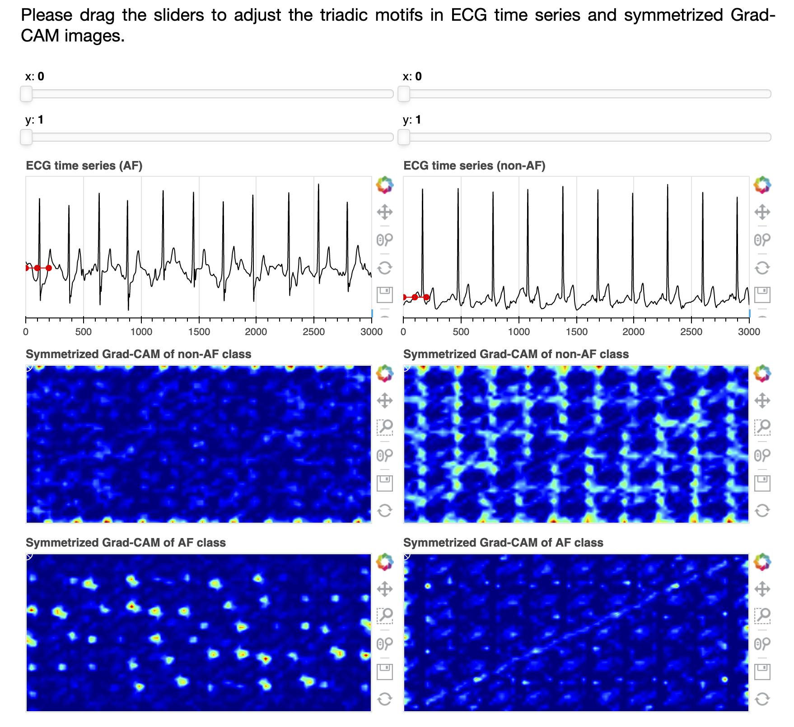

# An Interactive Demo of the Interpretation of the Anomaly Detection with Triadic Motif Fields.

[](https://arxiv.org/abs/2012.04936)
[](https://mybinder.org/v2/gh/ydup/bokeh/master?urlpath=/proxy/5006/bokeh-app)
[](https://paperswithcode.com/sota/atrial-fibrillation-detection-on-physionet?p=anomaly-detection-in-time-series-with-triadic)

Yadong Zhang and Xin Chen

[Preprint](https://arxiv.org/abs/2012.04936): [](https://arxiv.org/abs/2012.04936)

[Online demo](
https://mybinder.org/v2/gh/ydup/bokeh/master?urlpath=/proxy/5006/bokeh-app
):[](https://mybinder.org/v2/gh/ydup/bokeh/master?urlpath=/proxy/5006/bokeh-app)

Screenshot:



Cite our work with:
```latex
@misc{zhang2020anomaly,
      title={Anomaly Detection in Time Series with Triadic Motif Fields and Application in Atrial Fibrillation ECG Classification}, 
      author={Yadong Zhang and Xin Chen},
      year={2020},
      eprint={2012.04936},
      archivePrefix={arXiv},
      primaryClass={cs.LG}
}
```
